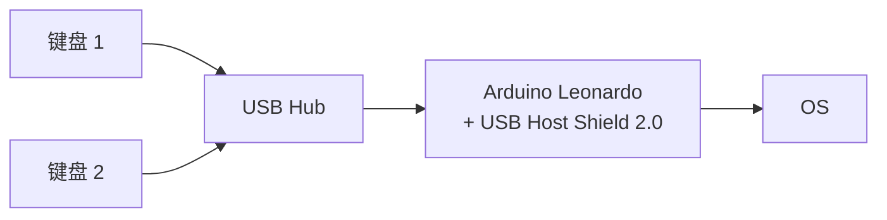

# keyboard-mergetool

基于 **Arduino Leonardo + USB Host Shield 2.0** 的双键盘合并器，试图解决多键盘并行输入时的状态冲突。
merge_all.ino适用于所有键盘，merge_mini.ino性能更高，但仅适用于部分键盘。

---

## 问题

在一台电脑上同时连接两把 USB 键盘时可能出现如下问题：

- 按住键盘 A 的某个键不放
- 再按住键盘 B 的某个键
- 保持几秒后松开键盘 B
- 键盘 B 的按键在松开后仍持续输出几十帧到几百帧

### 原因

操作系统为多个输入流维护同一个逻辑状态机，并通过时器机制实现按键自动重复，产生调度滞后。

### 解法

绕过操作系统，在硬件层提前完成状态合并，只向操作系统呈现一个逻辑键盘。

---

## 算法

维护三个bitset，每一位0/1表示当前对应字符松开/按下：

- `S1`：键盘1 当前按下集合
- `S2`：键盘2 当前按下集合
- `OUT`：最近一次发给电脑的集合

每次任一键盘状态更新后：

 `NEW = S1 | S2` 

为优化算法，只对差分进行操作，用xor提取差分：

 `DIFF = OUT ^ NEW` 

- if `NEW[u] == 1`：`NKROKeyboard.add(u)`
- else：`NKROKeyboard.remove(u)`

最后同步`OUT` ：

 `OUT = NEW`

其它优化&防抖设计详见源码。
---

## 依赖

 Arduino 库：

- USB Host Shield Library 2.0
    
    [https://github.com/felis/USB_Host_Shield_2.0](https://github.com/felis/USB_Host_Shield_2.0)
    
- HID-Project (NicoHood)
    
    [https://github.com/NicoHood/HID](https://github.com/NicoHood/HID)
    

硬件：

- Arduino Leonardo（ATmega32U4）
- USB Host Shield 2.0（MAX3421E）
- USB Hub